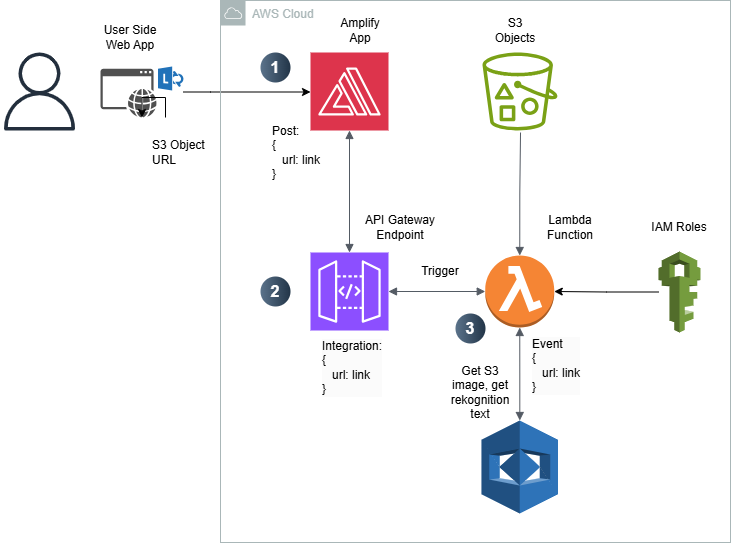

# cicc-formation

In this demo, we are going to experience how to use AWS CloudFormation templates to manipulate AWS resources with the spirit of Infrastructure as Code (IaC).

## Table of Contents

- [Introduction](#introduction)
- [Plans](#plans)
- [Details](#details)
    - [Step 1](#step-1-lambda-for-textract)
    - [Step 2](#step-2-api-gateway)
    - [Step 3](#step-3-create-an-amplify-app)
    - [Step 4](#step-4-deploy-the-amplify-app)
- [Future Work](#future-work)


## Introduction

- CloudFormation is the fundation for IaC practices on AWS.
- After playing around with AWS consoles, we can start the journey of IaC.
- Here is an comparison of [AWS CLI, SDK, CDK, and CloudFormation](compare.md). 
- With CloudFormation, we can purely use code to implement our previous project.
- After getting familiar with CloudFormation, we can reuse the templates to manipulate the AWS resources more flexibly and efficiently. 

  ** Diagram **
  

## Plans

- [ ] Step 1: Create Lambda for Textract and API Gateway
- [ ] Step 2: Create an Amplify APP
- [ ] Step 3: Set the Deployment of the Amplify APP
- [ ] Step 4: Set the Event Notification for Deployment Lambda
- [ ] Step 5: Trigger the Deployment


## Details

### Step 1: Create Lambda for Textract and API Gateway

#### Create the lambda function to Textract locally
Create the lambda function to receive the url of S3 image, and deliver it to Textract to detect the text information in the image. This [lambda function](backend/lambda_function.py) is in the folder of backend.

#### Deploy the lambda function and API Gateway Endpoint to AWS
To deploy this lambda function, we can CloudFormation. The [template](backend/proj3_backend.yml) is in the folder of backend.
You can use this yml file to create a CloudFormation stack to deploy resources of Textract Lambda function and API gateway endpoint.

We can find the deployed function, named ProcessImageFunction. This can be found in the code of our template:
```yaml
  ImageProcessingLambda:
    Type: AWS::Lambda::Function
    Properties:
      FunctionName: ProcessImageFunction
      Handler: "lambda_function.lambda_handler"
      Role: !GetAtt LambdaExecutionRole.Arn
      Code:
        S3Bucket: !Ref ExistingBucketName
        S3Key: proj3/lambda_function.zip  # The Lambda code uploaded to this S3 bucket
      Runtime: python3.13
      Timeout: 30 # Set timeout as needed (max 15 minutes for Lambda)`
```
- You can find this name as the *FunctionName* Properites.
- Modify *Handler: "lambda_function.lambda_handler"*: *lambda_function* is the name of your file for this lambda function, e.g., lambda_function.py; *lambda_handler* is the name of the lambda function, e.g., "def lambda_handler(event, context):".
- Modify the *S3Key*: this is the location of your lambda function inside your s3 bucket. You need to put your lambda function as a zip file inside your s3 bucket.

Similarly, you can modify the names of your api gateway endpoint, resourse name, stage name, etc. The YAML format is quite friendtly.

In the end, this stack will output the URL of your API gateway endpoint. You can use this as the connection point in your frontend html.


#### Test the lambda function
To test this lambda function, we can use the test body like:
```json
{
    "body": "{\"s3_url\":\"https://uco-cicc-media.s3.us-east-1.amazonaws.com/proj2/dt.jpg\"}"
}
```

Change the https link with your own S3 object URL.

#### Test the API Gateway method
You can use the test case:
```json
{
  "s3_url":"https://uco-cicc-media.s3.us-east-1.amazonaws.com/proj2/dt.jpg"
}
```

### Step 2: Create an Amplify APP
This step will create an empty Amplify app with a new branch.
You can [frontend/proj3_frontkend.yml](frontend/proj3_frontkend.yml) to create a new CloudFormation stack to do this job.
Feel free to chagne the app's name and brach name.
The output will include the URL for your frontend. But it's not ready, because it has not been deployed yet.


### Step 3: Set the Deployment of the Amplify APP
This step will deploy a lambda function to listen to the update event in your S3 bucket.
The lambda function can be found at [frontend/proj3_deployment_lambda.py](frontend/proj3_deployment_lambda.py).
You need to chagne the app ID and branch name of your Amplify APP, which are the outputs in Step 2 above.
```python
# Define the parameters for the Amplify deployment
    params = {
        'appId': 'dla4mus2cn52m',  # Replace with your Amplify App ID
        'branchName': 'dev',            # Replace with your branch name
        'sourceUrl': f"s3://{bucket}/{key}"
    }
```

You can change the parameters of your lambda function here just like in Step 1 above.
```yaml
TriggerLambdaFunction:
    Type: 'AWS::Lambda::Function'
    Properties:
      Handler: 'proj3_deployment_lambda.lambda_handler'
      Role: !GetAtt LambdaExecutionRole.Arn
      FunctionName: 'StartAmplifyDeployment'
      Runtime: 'python3.13'
      Code:
        S3Bucket: !Ref SourceCodeBucket  # Replace with your actual S3 bucket where the Lambda code is stored
        S3Key: 'proj3/proj3_deployment_lambda.zip'  # Path to the Lambda function code in S3
      Timeout: 30
      MemorySize: 128
```
The [frontend/proj3_amplify.yml](frontend/proj3_amplify.yml) can be used to create a new CloudFormation stack, to set up the "listener" for your S3 bucket. There should be an event to trigger this listener, and this event will be set up in Step 4 below.

### Step 4: Set the Event Notification for Deployment Lambda
You can go to your S3 bucket. Under properties, you can find the **Event Notifications** panel. 
- Click the *create event notification* button. 
- Set the name and prefix. The prefix can be the key of your zip file for the html, e.g. proj3/index.zip. 
- Check the box of *All object create events* under *Object creation*.
- Spcify the lambda function you created in Step 3 above, e.g., *StartAmplifyDeployment* in the yaml file in Step 3.

You also need to set proper S3 bucket policy. You can find the *Bucket policy* under **Permissions** of your S3 bucket.
- Add the following bucket policy:
```json
{
    "Version": "2012-10-17",
    "Statement": [
        {
            "Sid": "AllowAmplifyToListPrefix_dla4mus2cn52m_dev_proj3_index_zip",
            "Effect": "Allow",
            "Principal": {
                "Service": "amplify.amazonaws.com"
            },
            "Action": "s3:ListBucket",
            "Resource": "arn:aws:s3:::your-bucket-name",
            "Condition": {
                "StringEquals": {
                    "aws:SourceAccount": "your-account-id",
                    "aws:SourceArn": "arn%3Aaws%3Aamplify%3Aus-east-1%3Ayour-account-id%3Aapps%2Fyour-amplify-app-idm%2Fbranches%2Fdev",
                    "s3:prefix": "your-path/index.zip"
                }
            }
        },
        {
            "Sid": "AllowAmplifyToReadPrefix_your-amplify-app-id_dev_proj3_index_zip",
            "Effect": "Allow",
            "Principal": {
                "Service": "amplify.amazonaws.com"
            },
            "Action": "s3:GetObject",
            "Resource": "arn:aws:s3:::your-bucket-name/your-path/index.zip",
            "Condition": {
                "StringEquals": {
                    "aws:SourceAccount": "your-account-id",
                    "aws:SourceArn": "arn%3Aaws%3Aamplify%3Aus-east-1%3Ayour-account-id%3Aapps%2Fyour-amplify-app-id%2Fbranches%2Fdev"
                }
            }
        },
        {
            "Effect": "Deny",
            "Principal": "*",
            "Action": "s3:*",
            "Resource": "arn:aws:s3:::your-bucket-name/*",
            "Condition": {
                "Bool": {
                    "aws:SecureTransport": "false"
                }
            }
        }
    ]
}
```
- Replace *your-bucket-name*, *your-path*, *your-amplify-app-id*, *your-account-id*, using your information.
- Keep the URL encoding, such as %3A and %2F.
- Be careful here: make sure the arn is complete and correct.
- If you are in other region, change the region as well, e.g., us-east-1.


### Step 5: Trigger the Deployment
Simply upload the index.zip to your S3 bucket. This will trigger the deployment of your Amplify app.


## Future Work
- Set the event notification and S3 bucket policy, using programs, instead of web console.
- Enable automatic creation of the resources using AWS CDK and SDK, e.g., deliver the output of previous stack to the next stack (include the amplify app's ID in your lambda function automatically).
- CI-CD: once there is a change in your html or lambda functions, the change can be deployed automatically.
